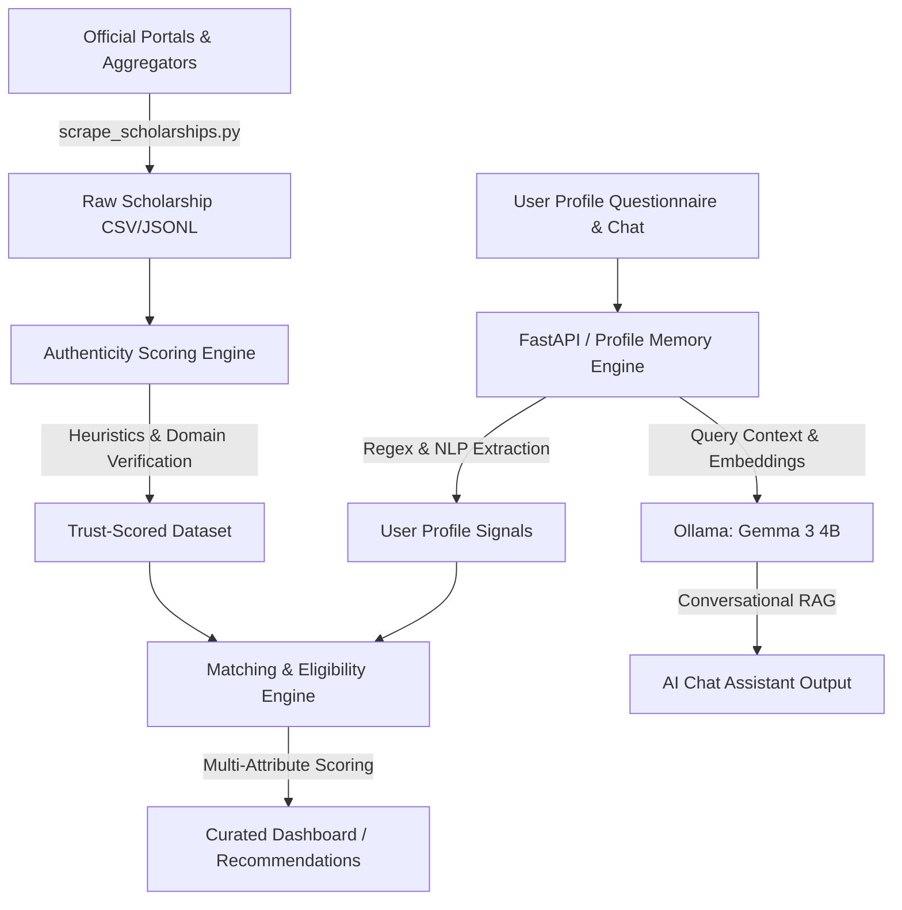

# AvorIQ 🚀

**Adaptive Vision for Opportunity and Resources Intelligence Quotient**

> **Your AI Learning Companion for Every Step of Student Life.**

[](https://nextjs.org/)
[](https://react.dev/)
[](https://tailwindcss.com/)
[](https://www.typescriptlang.org/)
[](LICENSE)

---

## 🎯 The Problem

Millions of deserving students globally—at High School, Undergraduate (UG), and Postgraduate (PG) levels—miss out on life-changing educational and financial opportunities because:

- Opportunity information is **fragmented** across hundreds of disorganized government, institutional, and private portals
- Eligibility rules are **dense, confusing**, and buried in complex administrative language
- **Critical deadlines** pass unnoticed, resulting in wasted institutional aid and missed admissions
- Socioeconomic and language barriers prevent students from successfully taking the next step

## 💡 Our Solution

**AvorIQ** aggregates, structures, and intelligently matches educational opportunities to each student's unique academic and socioeconomic profile, serving as an all-in-one ecosystem for higher studies.

### Version 1: Scholarship Intelligence Platform *(Active)*

A high-fidelity, AI-powered matching engine focused on helping students find the financial support they deserve:

| Feature | Description |
|---------|-------------|
| 🔍 **Smart Match Finder** | Input your profile → Get instant eligibility-scored scholarship matches |
| 📊 **Advanced Filters** | Filter by category (Govt/Private/NGO), education level, amount, deadline |
| 💬 **AI Chat Assistant** | Conversational AI that helps you discover and understand scholarships |
| 📋 **Application Tracker** | Track progress from Saved → Documents Verified → Applied → Approved → Funds Received |
| 📄 **Detailed Modals** | Complete info: eligibility, documents checklist, application steps, FAQs |
| 🔖 **Save & Bookmark** | Shortlist opportunities and manage them from a personal dashboard |

---

## 🛠 Repository Structure

```
AvorIQ-Lab/
├── avoriq/                      # Main application monorepo
│   ├── frontend/                # ✅ Active: Next.js 16 App Router
│   │   ├── app/                 #    Pages (landing, dashboard, scholarships, chat, etc.)
│   │   ├── components/          #    UI components, marketing sections, ReactBits
│   │   ├── data/                #    Mock scholarship dataset & site content
│   │   ├── hooks/               #    Custom React hooks (localStorage, chatLimit)
│   │   ├── types/               #    TypeScript interfaces
│   │   └── public/              #    Static assets (logo, fonts)
│   ├── backend/                 # 🔜 Planned: FastAPI + pgvector search
│   ├── agents/                  # 🔜 Planned: LLM routing & intent detection
│   ├── scripts/                 # 🔜 Planned: Scholarship data scrapers
│   ├── whatsapp/                # 🔜 Planned: WhatsApp webhook integration
│   └── n8n/                     # 🔜 Planned: Workflow automation
├── datasets/                    # Raw data for RAG pipeline
├── docs/                        # Architecture diagrams & specs
├── logo/                        # Brand assets
└── README.md                    # ← You are here
```

---

## 💻 Tech Stack

### Frontend *(Active)*
- **Framework**: [Next.js 16](https://nextjs.org/) (App Router, React 19, TypeScript)
- **Styling**: [Tailwind CSS v4](https://tailwindcss.com/) + Custom Design System (Warm Charcoal + Terracotta)
- **Animations**: [Framer Motion](https://www.framer.com/motion/) + [Canvas Confetti](https://www.npmjs.com/package/canvas-confetti)
- **Typography**: Instrument Serif (editorial headlines) + Inter (body)
- **Icons**: [Lucide Icons](https://lucide.dev/)
- **State**: LocalStorage synchronization hooks

### Backend & AI *(Roadmap)*
- **Server**: FastAPI (Python)
- **Database**: PostgreSQL + pgvector (vector similarity search)
- **LLM Engine**: Ollama (Gemma 3 4B locally hosted via CPU)
- **Automation**: n8n workflow engine

---

## 🚀 Getting Started

### Prerequisites
- [Node.js](https://nodejs.org/) v18+ and npm

### Run Locally

```bash
# 1. Clone the repository
git clone https://github.com/YOUR_USERNAME/AvorIQ-Lab.git
cd AvorIQ-Lab

# 2. Navigate to the frontend
cd avoriq/frontend

# 3. Install dependencies
npm install

# 4. Start the dev server
npm run dev
```

Open [http://localhost:3000](http://localhost:3000) in your browser.

### Build for Production

```bash
npm run build
npm start
```

---

## 🗺 Product Roadmap

| Phase | Module | Status |
|-------|--------|--------|
| **V1** | Scholarship Intelligence Platform | ✅ Active |
| **V1** | AI Study Planner & Exam Prep Assistant | ✅ Active |
| **V1** | YouTube Learning Companion | ✅ Active |
| **V1** | Career Navigator | ✅ Active |
| **V1** | Community Forums | ✅ Active |
| **V2** | RAG Vector Search Engine | 🔜 Planned |

---

## 🎨 Design Philosophy

> *"If Spotify + Duolingo + Perplexity + Notion built an education app."*

- **Warm Dark Mode** — Charcoal tones (#1A1A1A), not cold navy
- **Terracotta Accent** (#E8715A) — Unique, warm brand identity
- **Editorial Typography** — Instrument Serif headlines + Inter body
- **Generous Whitespace** — Claude.ai-inspired clean layouts
- **Micro-Animations** — Tasteful motion for engagement
- **Glassmorphism** — Frosted glass surfaces for depth

---

## ⚖ Core Values

- **Accessibility**: Available 24/7 on web, supporting simple and intuitive user profiles
- **Equity**: Intentionally designed to prioritize underprivileged and low-income students globally
- **Trust**: Only linking to verified, official application websites and accredited institutional/corporate portals
- **Empowerment**: Removing financial barriers so students can pursue education without debt or dropouts

---

## 🏆 USAII Global Hackathon Submission Details

AvorIQ is designed and submitted as a premium entry for the **USAII Global Hackathon**, focusing on social impact, technical scalability, and advanced AI integration.

### 📌 Track & Challenge Selection
* **Track Selection**: `College / Undergraduate`
* **Challenge Direction**: `Public Services: Fix Systems People Depend On (Benefits Navigator)`
* **Challenge Fit**: The educational scholarship ecosystem is highly fragmented, bureaucratic, and difficult to navigate. Over $15 Billion in student welfare benefits and scholarships go unclaimed annually globally due to split portals, complex eligibility criteria, and missed deadlines. AvorIQ acts as an intelligent **Benefits Navigator** that aggregates opportunities, validates source-trust, scores eligibility, and tracks student applications to completion.

---

### ⚙️ AI Architecture Explanation

AvorIQ features a dual-layer AI architecture combining high-performance deterministic heuristics for eligibility matching with local Large Language Models (LLMs) for conversational reasoning.



#### 1. Inputs (What Data Goes In)
* **User Profile Inputs**: Domicile state/country, education level (High School, Undergraduate (UG), and Postgraduate (PG)), academic stream, gender, annual family income, caste/category, and specific career interests.
* **Conversational Inputs**: Natural language user messages/queries directed to the AI Chat Assistant (e.g., *"I am a female undergraduate student studying engineering, family income is $35,000, find me scholarships"*).
* **Data Sources**: Aggregated scholarship records from official institutional, corporate, and government open-data portals.

#### 2. AI Capabilities Used
* **Information Extraction (NLP)**: Automated parsing of profile parameters (age, state, income, stream) directly from raw text queries using regular expression matching and pattern recognition.
* **Multi-Attribute Matching & Scoring**: Eligibility engine computing distance metrics between student profiles and scholarship requirements.
* **Source Trust & Heuristics Classification**: Algorithmic scoring of source links, metadata density, and domain suffixes to classify scholarships into safety categories.
* **Conversational AI / Local LLM**: Locally hosted Large Language Model (`gemma3:4b` chat via Ollama) for text generation, query understanding, and contextual explanation of eligibility rules.

#### 3. What Processing Happens
* **Profile Signal Merging**: When a user chats or fills a questionnaire, the backend extracts profile attributes and updates the profile DB.
* **Trust Scoring Heuristics**: The `authenticity.py` module evaluates scholarship data quality. A baseline score is computed:
  * Official government and academic domains (e.g., `.gov`, `.edu`, `.org`) receive a premium trust boost.
  * Presence of active application links, structured descriptions, and recent deadlines are checked.
  * Outputs are categorized: `authentic` (Score >= 80), `review` (50 <= Score < 80), or `low_trust` (Score < 50).
* **Relevance Matching Engine**: Profiles are scored against scholarships in real-time:
  * State/Location domicile match: +30 points.
  * Education level match: +20 points.
  * Stream/Academic focus match: +20 points.
  * Gender alignment: +10 points.
  * Income threshold check: Strict absolute validation (must be below max income cap).
* **Conversational RAG Routing**: User queries trigger semantic vector matches (using `nomic-embed-text` on PGVector). The local LLM synthesizes answers with exact citations and document checklists. If the backend is offline, the system seamlessly falls back to a fast client-side token matcher.

#### 4. Outputs (What the User Receives)
* **Relevance-Ranked Feed**: An interactive, eligibility-scored dashboard showing exact percentage matches.
* **Trust Verification Badges**: Visible confidence labels ensuring students apply only to genuine schemes.
* **Application Lifecycle Tracker**: Visual progress milestones (Saved -> Documents Checked -> Applied -> Approved -> Funds Received) with celebration micro-animations.
* **Actionable Conversational Answers**: Step-by-step application guides, documents required checklists, and deep links to official application portals.

---

### 🤝 Human-in-the-Loop (HITL) Decision

**The Decision the AI Does NOT Make**:
The AI **does not** auto-submit applications, auto-verify legal document authenticity, or make final scholarship disbursement decisions.

**Why a Human Must Remain Involved at this Point**:
1. **Verification of Legal and Financial Credentials**: Scholarships require formal certificates (income certificates, academic transcripts, enrollment letters). AI can only match the student's claimed parameters; human administrators from the respective sponsoring or corporate CSR bodies must manually inspect and verify these legal uploads to prevent fraud.
2. **Final Financial Disbursement**: Because public and corporate funds are disbursed, final approval carries legal liability. Human officers must check bank details and sign off on transactions to ensure financial compliance and integrity.
3. **Application Autonomy**: Students must manually review their matching applications and submit them on official external portals. This ensures the student is aware of terms & conditions and prevents automated bot applications from spamming official sites.

---

### 🛡️ Responsible AI Guardrail

**What is one risk in your system and how did you reduce it?**
* **The Risk (Misinformation & Phishing Scams):** A major hazard in scraper-driven scholarship platforms is the potential for indexation of fake, fraudulent, or outdated schemes. Cybercriminals often construct lookalike scholarship portals requesting minor "processing fees" or harvesting highly sensitive personal details (e.g., identity documents, financial credentials) from vulnerable, low-income students.
* **How We Reduced It (Multi-Tiered Authenticity Scoring & Outbound Constraints):**
  1. *Domain Whitelisting & Suffix Rules:* The backend (`authenticity.py`) automatically whitelists and upgrades domain suffixes belonging directly to government networks and accredited higher education institutions.
  2. *Quantitative Authenticity Index:* Each scraped scheme is analyzed and given a rating out of 100 based on metadata completeness, deadline presence, and origin history.
  3. *Triage UI Badges:* Low-trust matches (<50 points) are automatically filtered out. Mid-range trust matches (50-80 points) are flagged with warning overlays advising human check, and only high-confidence listings (80+ points) are labeled as `authentic`.
  4. *Outbound Restriction:* AvorIQ never captures application fees or hosts form inputs directly, and redirects users exclusively to the verified official portal, eliminating intermediary scam risks.

---

## 👥 Team

Built with ❤️ for students globally.

---

## 📄 License

This project is licensed under the MIT License - see the [LICENSE](LICENSE) file for details.
