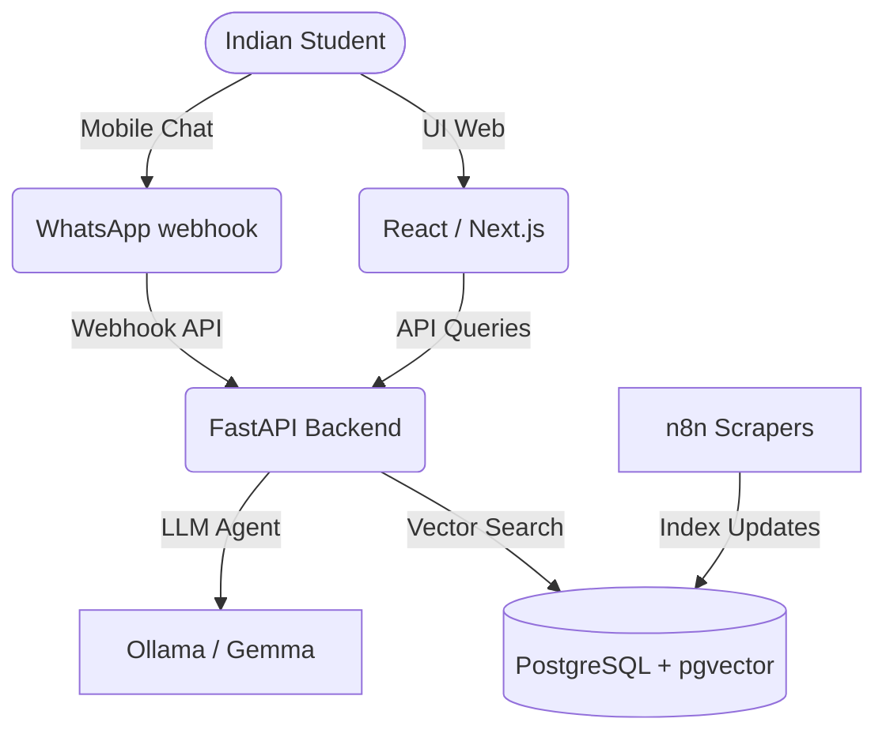

# AvorIQ (Adaptive Vision for Opportunity and Resources Intelligence Quotient)

> **Your AI Learning Companion for Every Step of Student Life.**

AvorIQ is an AI-powered educational second brain designed specifically for Indian students from Class 6 to Graduation. It transforms information fragmentation and uncertainty into clear, personalized, and structured action.

---

## 🎯 The Problem & Our Solution

### The Problem
Millions of deserving students in India—across rural villages, government schools, and tier-2/3 cities—miss out on life-changing opportunities because:
- Scholarship and exam information is fragmented across hundreds of disorganized portals.
- Eligibility rules are dense, confusing, and difficult to comprehend.
- Critical deadlines pass by unnoticed, resulting in wasted funds and missed admissions.
- Language barriers and a lack of counseling prevent students from applying.

### Our Solution (AvorIQ)
AvorIQ aggregates, structures, and matches educational opportunities specifically to the student's unique academic and socioeconomic profile.
- **For Today (Version 1)**: A high-fidelity, client-side matching engine focused on **Scholarship Intelligence**, tracking deadlines, managing documents, and simulating AI recommendation workflows.
- **For Tomorrow (Roadmap)**: A fully integrated, vector-supported (RAG) assistant responding to voice, web, and WhatsApp queries, paired with custom learning paths and exam planners.

---

## 🛠 Repository Directory Structure

To fulfill our multi-module vision, the project workspace is organized into dedicated layers:

- [`frontend/`](file:///e:/AvorIQ-Lab/avoriq/frontend/): Premium Next.js App Router project containing the responsive dashboard interfaces.
- [`agents/`](file:///e:/AvorIQ-Lab/avoriq/agents/): Autonomous LLM routing scripts (Intent detection, prompt templates, tool selectors).
- [`backend/`](file:///e:/AvorIQ-Lab/avoriq/backend/): FastAPI server exposing opportunity search and profiling endpoints.
- [`n8n/`](file:///e:/AvorIQ-Lab/avoriq/n8n/): Automated visual cron triggers and notification flows to push alerts.
- [`scripts/`](file:///e:/AvorIQ-Lab/avoriq/scripts/): Python scraper crawlers indexing official scholarship boards.
- [`whatsapp/`](file:///e:/AvorIQ-Lab/avoriq/whatsapp/): Twilio/WhatsApp Webhook integrations syncing mobile chat to the agent.

---

## 🗺 Platform Roadmap & Vision

### Module 1: Scholarship Intelligence Platform (V1 - Active)
- **Interactive Match Finder**: Input name, income, caste, state, gender, and stream to see instant eligibility matches.
- **Smart Filters & Sorts**: Vetted results filterable by minimum reward values, provider types (Govt/Private/NGO), and nearest deadlines.
- **Opportunity Detail Modals**: Explaining selection processes, checklists of required documents, official links, and FAQs.
- **Milestone Tracker Dashboard**: Monitor application stages from "Saved" to "Vetted" to "Funds Disbursed" in real time.
- **AI Assistant Simulator**: Mocking Perplexity-style prompt answers using vetted Indian scholarship datasets.

### Module 2: AI Study Planner (Phase 2 - Coming Soon)
- Custom adaptive study calendars based on exam dates (Boards, JEE, NEET).
- Automated syllabus breakdowns mapping daily chapters to study goals.

### Module 3: Exam Prep Assistant (Phase 2 - Coming Soon)
- Instant mock test grading and explanations for past year papers.
- Weakness tracking analytics pointing out chapters that need review.

### Module 4: WhatsApp AI Agent (Phase 2 - Coming Soon)
- Receive weekly eligibility matching digests.
- Check deadlines and verify documents by messaging our WhatsApp bot.

### Module 5: RAG & Vector Engine (Phase 3 - Coming Soon)
- A FastAPI backend connecting to a **PostgreSQL** database with **pgvector**.
- **Ollama / Gemma** embeddings translating query inputs to find semantically relevant scholarships.

---

## 💻 Tech Stack Configuration



### Frontend Stack (Active)
- **Framework**: Next.js App Router (React 19, TypeScript)
- **Styling**: Tailwind CSS v4, Custom Glassmorphism, Mesh Gradients
- **Animations**: Framer Motion transitions, Canvas Confetti triggers
- **Icons**: Lucide Icons
- **State Management**: LocalStorage synchronization hooks

### Backend & AI Stack (Roadmap)
- **Server**: FastAPI, Python
- **Database**: PostgreSQL (Vector store using `pgvector`)
- **LLM Engine**: Ollama (Running Gemma 2B & Llama 3 models locally)
- **Pipelines**: n8n workflow engine

---

## 🚀 Getting Started (Frontend)

To run the active AvorIQ frontend locally:

1. Navigate to the frontend directory:
   ```bash
   cd frontend
   ```
2. Install dependencies:
   ```bash
   npm install
   ```
3. Run the development server:
   ```bash
   npm run dev
   ```
4. Open [http://localhost:3000](http://localhost:3000) in your browser.

---

## ⚖ Core Values
- **Accessibility**: Available on web and WhatsApp, supporting simple language profiles.
- **Equity**: Intentionally designed to prioritize rural, government school, and low-income students.
- **Trust**: Directly routing only to verified, official application websites.
