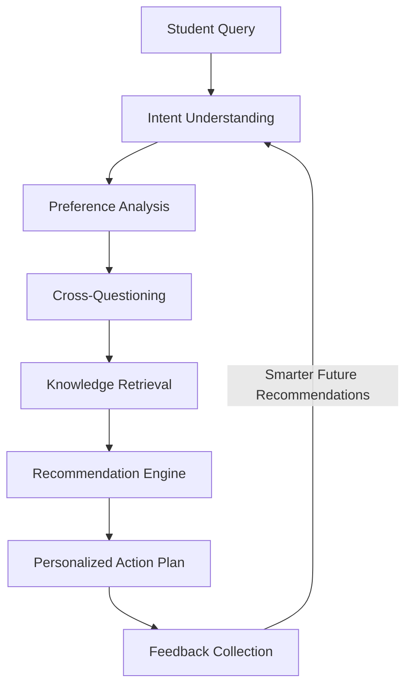

# AvorIQ: The AI Second Brain for Students

## Inspiration

Millions of students globally make important educational and career decisions using fragmented information from online forums, random Google searches, and advice from acquaintances. Students often miss scholarships, opportunities, deadlines, and career pathways simply because they lack personalized guidance.

We wanted to build an AI system that does more than answer questions. We asked ourselves:

> What if every student had an educational companion that understood how they learn, what they aspire to become, and guided them toward meaningful action?

That idea became **AvorIQ**.

## What it does

AvorIQ is an AI-powered educational second brain designed for High School, Undergraduate (UG), and Postgraduate (PG) students. Instead of giving the same answers to everyone, it continuously adapts to each student's preferences, goals, and constraints.

Students can describe their ambitions in natural language, such as:

> "I want to become an AI Engineer."

AvorIQ asks follow-up questions to understand their situation, preferred learning style, available study time, and existing knowledge. It then generates a personalized roadmap with learning resources, projects, opportunities, and actionable next steps.

Rather than simply retrieving information, AvorIQ transforms uncertainty into structured execution plans.

## How we built it

AvorIQ combines conversational AI with adaptive recommendation mechanisms.

Workflow:

The system uses a structured knowledge base containing educational resources, opportunities, and career pathways to provide grounded recommendations with citations.

## Challenges we ran into

One of our biggest challenges was avoiding generic AI responses. We wanted recommendations to reflect individual learning preferences instead of popularity.

Another challenge was balancing personalization with responsible AI practices. Educational guidance should empower students without replacing their own decision-making. We designed AvorIQ to present multiple pathways, provide trusted sources, and encourage students to remain in control of important life decisions.

## Accomplishments that we're proud of

We built an AI system that learns from conversations and adapts over time instead of treating every student the same.

Most educational AI answers questions.

AvorIQ learns who the student is.

## What we learned

Building AvorIQ taught us that meaningful AI is not about generating more information—it's about helping people think clearly, understand trade-offs, and take confident next steps.

## What's next for AvorIQ

Our long-term vision is to evolve AvorIQ into a lifelong learning companion that supports students from education to career, ensuring that no student misses opportunities because they lacked guidance.
